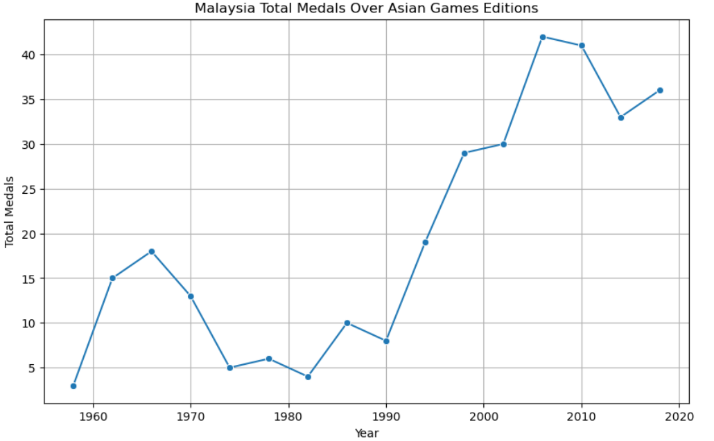
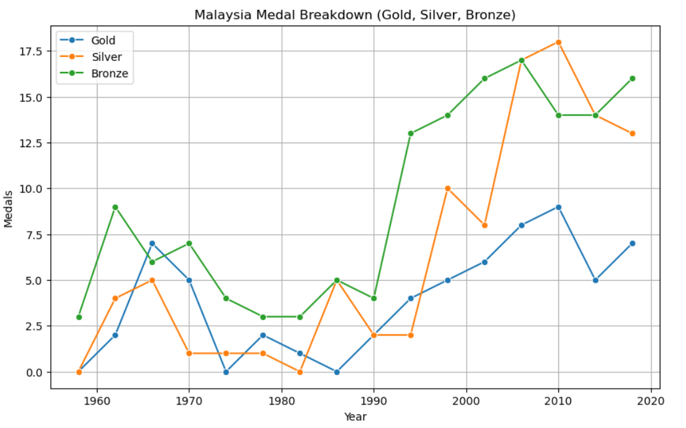

# 🇲🇾 Malaysia at the Asian Games: Data Analysis Project
"How Has Malaysia Performed in the Asian Games?"

This project explores Malaysia's historical performance in the Asian Games using Python and data analysis tools like Pandas and Seaborn. It's designed to showcase my end-to-end data analytics skills, from data cleaning to visualization and storytelling.

## 🧠 Objectives
- Analyze Malaysia’s medal trends from 1958 to 2018
- Identify peak performance years
- Understand the breakdown between gold, silver, and bronze
- Practice data storytelling and visualization for a real-world dataset

## 📁 Files
- `Malaysia_Asian_Games_Analysis.ipynb` — Main Jupyter notebook
- `asian_games_medals.csv` — Source dataset

## 🛠️ Tools & Skills Used
- Python
- Pandas, NumPy
- Seaborn, Matplotlib
- Jupyter Notebook
- Data Cleaning
- Data Visualization
- Insight Generation

## 📈 Key Insights

- Malaysia's medal count steadily increased since 1990
- The country had its best performance in 2006 with 42 medals
- Bronze medals are more common than gold, showing competitive edge

## 📌 Reflections
This was my first end-to-end data analytics project. It helped me apply what I've learned about data cleaning, Pandas, and visual storytelling — and I’m excited to keep building more projects like this, especially in the sports industry.

## 🔗 Project Link
Live on GitHub: [https://github.com/yanieriz/malaysia-asian-games-analysis](https://github.com/yanieriz/malaysia-asian-games-analysis)

---
